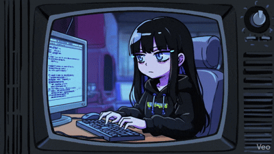

# 🎮 [GWAK GEUN O] - Gameplay Programmer

 

## 👨‍💻 About Me
* **라이브 서비스 & 툴 엔지니어링:** 지난 4년간 라이브 개발팀에서 마일스톤 기간에 맞춰 다양한 미니게임과 스토리 연출 툴을 개발하며, 게임 개발 프로세스를 이해하고 있습니다.
* **AI 기반 워크플로우 효율화:** Aura, ClaudeCode 등 AI 에이전트를 활용해 코드 리뷰와 유닛 테스트를 자동화하고, 전반적인 개발 생산성을 크게 개선한 경험이 있습니다.
* **Next Step (Unreal Engine & C++):** 탄탄한 실무 경험을 디딤돌 삼아, 현재는 커리어의 다음 목표인 슈터 장르 게임 개발에 집중하고 있습니다. 이를 위해 언리얼 엔진 기반의 개인 프로젝트를 진행하며 실력과 경험을 쌓아가고 있습니다.

 

## 🛠️ Tech Stack

### 🔹 Languages
  

### 🔹 Engines & Graphics
  

### 🔹 Development Tools
   

### 🔹 Specialty
`FPS/TPS Mechanics` `Behavior Tree & State Tree (AI)` `GAS (Gameplay Ability System)` `Dedicated Server`

 

## 💼 Professional Experience

### GUARDIAN TALES | Junior Gameplay Programmer
**2022.10 ~ 2026.05 (3년 8개월) / Unity, C#, Lua**
* **마일스톤 주도 개발:** 라이브 서비스 주기에 맞춘 다양한 장르의 미니 게임 개발 및 스토리 연출, 실시간 이슈 대응
* **에디터 툴 엔지니어링:** 기획자와 아트 팀의 작업 효율을 극대화하기 위한 연출 전용 에디터 툴 및 뷰어 개발

 

## 🚀 Core Engineering & Personal Projects

**주요 연구 분야: Unreal Engine & C++**

**1. Advanced Movement & Combat System**
* **이동 메카닉 설계:** 물리(Physics) 기반의 로켓 점프, 벽 타기(Wall-run) 등 복잡한 커스텀 무브먼트 컴포넌트 개발 및 네트워크 복제(Replication) 최적화
* **전투 아키텍처:** 정교한 무기 반동(Recoil) 시스템, 투사체 물리 시뮬레이션 및 데이터 주도형(Data-driven) 스킬 시스템 구축

**3. Workflow Automation & Tooling**
* **데이터 테이블 연동:** 기획자가 프로그래머의 개입 없이 직접 데이터를 수정할 수 있는 커스텀 에디터 툴 개발
* **AI 워크플로우 도입:** 파이프라인 고도화를 위해 AI Agent를 결합한 자동화된 코드 리뷰 및 유닛 테스트 환경 구축

 

---

  

📫 **Contact:** [spdhfh31@gmail.com] [[게임잡](https://www.gamejob.co.kr/User/Resume/View?R_NO=209294)] [[LinkedIn](https://www.linkedin.com/in/geonoh-kwak-814a33242/)] | 📝 **Blog:** [[티스토리](https://isekaihato.tistory.com/)]
